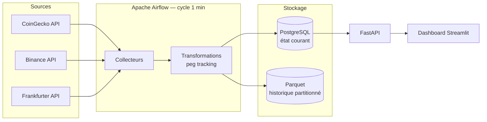

# 🌍 Crypto Market Pipeline — MVP Sénégal/UEMOA
[](https://github.com/SeydinaMNdao-001/crypto-data-pipeline/actions/workflows/ci.yml)
Pipeline de données quasi temps réel pour 12 crypto-actifs, avec une
dimension analytique centrée sur le contexte financier de l'UEMOA :
affichage en FCFA, suivi du peg des stablecoins dans la durée, et
comparaison de la volatilité crypto à la stabilité du franc CFA.

Ce projet n'est pas un énième dashboard crypto — c'est une chaîne de
données complète : ingestion multi-source, orchestration, stockage
transactionnel + analytique, API, et restitution BI, entièrement
reproductible en local via Docker Compose.

## Sommaire

- [Architecture](#architecture)
- [Stack technique](#stack-technique)
- [Démarrage rapide](#démarrage-rapide)
- [Utilisation](#utilisation)
- [Modèle de données](#modèle-de-données)
- [Tests](#tests)
- [Limites et précautions](#limites-et-précautions)
- [Évolutions possibles](#évolutions-possibles)

## Architecture



Chaque collecteur valide ses données (champs obligatoires, plausibilité,
fraîcheur) et retente automatiquement en cas d'erreur temporaire
(backoff exponentiel) avant d'écrire en base — voir
[Limites et précautions](#limites-et-précautions) pour le détail des
garanties et de leurs limites.

## Stack technique

| Domaine | Technologie |
|---|---|
| Langage | Python 3.11 |
| Orchestration | Apache Airflow 3 (CeleryExecutor) |
| Stockage transactionnel | PostgreSQL 16 |
| Stockage analytique | Parquet partitionné (pyarrow) |
| API | FastAPI |
| Dashboard | Streamlit + Plotly |
| Tests | pytest |
| Conteneurisation | Docker / Docker Compose |

## Démarrage rapide

Prérequis : Docker Desktop, Python 3.11+, Git.

```bash
git clone <url-du-repo>
cd crypto-data-pipeline

# Configuration
cp .env.example .env
# Éditer .env : ajouter une clé CoinGecko Demo (gratuite sur
# https://www.coingecko.com/en/api/pricing) et un mot de passe PostgreSQL

python3.11 -m venv venv
source venv/bin/activate
pip install -r requirements.txt

# Lancer toute la stack
docker compose build
docker compose up airflow-init
docker compose up -d

# Activer le DAG (en pause par défaut au premier démarrage)
docker exec -it $(docker ps -qf "name=airflow-scheduler") \
  airflow dags unpause crypto_market_pipeline
```

## Guide de déploiement détaillé

Cette section s'adresse à quiconque clone ce dépôt pour la première fois,
sans accompagnement.

### Prérequis

- Docker Desktop (macOS, Windows ou Linux) — au moins 4 Go de RAM et
  10 Go d'espace disque alloués à Docker
- Python 3.11+
- Git
- Une clé API CoinGecko Demo (gratuite, voir ci-dessous)

### 1. Cloner et configurer l'environnement

```bash
git clone <url-du-repo>
cd crypto-data-pipeline
cp .env.example .env
```

Édite `.env` et renseigne :

| Variable | Description | Où l'obtenir |
|---|---|---|
| `COINGECKO_API_KEY` | Clé Demo CoinGecko | [coingecko.com/en/api/pricing](https://www.coingecko.com/en/api/pricing) → *Create Free Account* → *Developer Dashboard* → *API Keys* |
| `POSTGRES_USER` / `POSTGRES_PASSWORD` / `POSTGRES_DB` | Identifiants de la base applicative | À choisir librement |
| `POSTGRES_HOST` / `POSTGRES_PORT` | Connexion locale | Laisser `localhost` / `5432` |
| `XOF_EUR_FIXED_RATE` | Parité fixe EUR/XOF | `655.957` (valeur officielle, ne pas modifier) |
| `AIRFLOW_UID` | Utilisateur système Airflow | `50000` (valeur recommandée) |

⚠️ Une variable par ligne, sans exception — un fichier `.env` sans retour
à la ligne final, complété ensuite via `>>`, peut fusionner deux variables
sur une même ligne et faire planter Airflow au démarrage (incident
documenté plus bas).

### 2. Environnement Python local (pour les tests, hors Docker)

```bash
python3.11 -m venv venv
source venv/bin/activate
pip install -r requirements.txt
```

### 3. Construire et démarrer toute la stack

```bash
docker compose build
docker compose up airflow-init
docker compose up -d
```

Patiente 1 à 2 minutes, puis vérifie que tout est sain :
```bash
docker ps --format "table {{.Names}}\t{{.Status}}"
```
Tous les conteneurs doivent afficher `healthy`.

### 4. Activer le pipeline

Le DAG démarre **en pause** par défaut — comportement normal d'Airflow,
pas une erreur :
```bash
docker exec -it $(docker ps -qf "name=airflow-scheduler") \
  airflow dags unpause crypto_market_pipeline
```

### 5. Vérifier

| Interface | URL | Identifiants |
|---|---|---|
| Dashboard | http://localhost:8501 | — |
| API (docs interactives) | http://localhost:8000/docs | — |
| Airflow | http://localhost:8080 | airflow / airflow |

```bash
curl http://localhost:8000/health
```
Doit répondre `{"status":"ok"}`. Après 2-3 minutes de collecte :
```bash
docker exec -it $(docker ps -qf "name=postgres-app") \
  psql -U crypto_user -d crypto_pipeline -c "SELECT COUNT(*) FROM crypto_market_snapshot;"
```
Le compteur doit être non nul et croissant d'un appel à l'autre.

### Dépannage courant

| Symptôme | Cause probable | Solution |
|---|---|---|
| DAG absent de l'UI, aucune erreur listée | Fichier DAG mal structuré | `docker exec -it <scheduler> airflow dags list-import-errors`, puis relire la syntaxe |
| `ValueError` au démarrage d'Airflow | `.env` corrompu (lignes fusionnées) | Vérifier une variable par ligne dans `.env` |
| Dashboard sans données | API non démarrée, ou base encore vide | `docker ps` pour l'état des conteneurs ; patienter 1-2 cycles |
| Modification d'un collecteur externe renvoie une erreur 400 | Paramètres mal formatés (espaces superflus) | Vérifier le format exact attendu par l'API tierce |

### Réinitialiser complètement

```bash
docker compose down -v   # supprime aussi les données (Postgres + métadonnées Airflow)
docker compose up airflow-init
docker compose up -d
```

## Utilisation


| Interface | URL | Identifiants |
|---|---|---|
| Dashboard | http://localhost:8501 | — |
| API (docs interactives) | http://localhost:8000/docs | — |
| Airflow | http://localhost:8080 | airflow / airflow |

Le dashboard comprend 6 vues : Vue générale, Crypto Explorer,
Comparaison, Stablecoins, Contexte FCFA/UEMOA, et Qualité Pipeline.

## Modèle de données

Table principale `crypto_market_snapshot` (un enregistrement par actif,
par source, par cycle de collecte) : prix USD/FCFA, volume, market cap,
variation 24h, source. Table `stablecoin_peg_history` : écart de peg
historisé pour USDT/USDC/DAI, avec flag d'alerte au-delà de 0,5 %. Table
`fx_rate_history` : historique du taux USD/EUR/XOF, nécessaire pour
comparer objectivement la volatilité crypto à la stabilité du FCFA.
Schéma complet : [`sql/schema.sql`](sql/schema.sql).

## Tests

```bash
pytest -m "not integration" -v   # tests unitaires, sans Docker
pytest -v                        # suite complète, Docker requis
```

Détail dans [`docs/TEST_REPORT.md`](docs/TEST_REPORT.md).

Détail dans [`docs/TEST_REPORT.md`](docs/TEST_REPORT.md).

## Incidents rencontrés et résolutions

Ce projet n'a pas été construit sans accroc — ces incidents sont documentés
volontairement plutôt que masqués, parce qu'ils reflètent le vrai travail
d'un pipeline de données : anticiper ce qui casse, diagnostiquer
méthodiquement, corriger, et vérifier.

| Incident | Symptôme | Cause racine | Résolution |
|---|---|---|---|
| Paramètre Binance rejeté (400) | `symbols` refusé par l'API | `json.dumps()` insère des espaces ; Binance exige un JSON compact | `separators=(",", ":")` |
| Prix stablecoin à zéro accepté | DAI affichait `0.0 $` sans erreur | La validation ne vérifiait que la *présence* des champs, pas leur plausibilité ni leur fraîcheur | Contrôle d'âge (`MAX_STALENESS`) et de valeur (`price > 0`) |
| Perte silencieuse de données Parquet | Le nombre de fichiers n'augmentait pas entre deux cycles | Nom de fichier identique à chaque écriture → écrasement, pas d'ajout | Nom de fichier unique (`uuid4`) par écriture |
| `.env` corrompu, Airflow refuse de démarrer | `ValueError: could not convert string to float` | Deux variables fusionnées sur la même ligne (fichier sans retour à la ligne final + `>>`) | Fichier corrigé, ligne par variable |
| DAG invisible dans Airflow, aucune erreur signalée | UI vide, `list-import-errors` vide aussi | Appel `crypto_market_pipeline()` imbriqué *à l'intérieur* de la fonction elle-même — aucun DAG n'était jamais réellement construit | Appel déplacé au niveau module, hors de la fonction |
| Duplication silencieuse en base | Détecté uniquement en écrivant le test d'idempotence | Aucune contrainte d'unicité — un retry Airflow réinsère le même cycle | Contrainte `UNIQUE` + `ON CONFLICT DO NOTHING` |
| 3 échecs CI sur un push jugé "propre" | Tests verts en local, rouges sur GitHub Actions | Fichiers jamais commités (`fx_collector.py`...), virgule manquante dans `schema.sql`, test dépendant de données préexistantes | Fichiers ajoutés, SQL corrigé, test rendu autonome |

**Deux incidents valent un détour plus détaillé :**

*Le DAG fantôme.* Airflow ne signalait ni erreur de syntaxe, ni erreur
d'import — juste un DAG absent de toutes les listes, sans explication.
La cause : l'appel qui déclenche la construction du DAG
(`crypto_market_pipeline()`, en dehors de la fonction décorée par `@dag`)
s'était retrouvé collé *à l'intérieur* de cette même fonction lors d'une
édition précédente. Un fichier Python parfaitement valide, qui ne
produisait simplement... rien. Résolu en comparant le fichier réel à sa
structure attendue plutôt qu'en devinant.

*Le CI comme filet de sécurité, pas comme formalité.* La mise en place de
GitHub Actions a immédiatement révélé que deux fichiers sources
fonctionnaient en local et dans Docker (qui lisent le disque directement)
mais n'avaient **jamais été réellement commités dans Git** — invisible
tant que rien ne clonait le dépôt à froid. Une virgule manquante dans
`schema.sql`, sans conséquence en local (la table existait déjà depuis
des semaines), cassait la création de la base sur un environnement
neuf. Aucun de ces deux problèmes n'était détectable sans un
environnement d'exécution complètement indépendant du poste de
développement — exactement la raison d'être du CI.

## Limites et précautions

## Limites et précautions

- Les données de marché externes peuvent être incomplètes, retardées ou
  temporairement indisponibles — le pipeline continue de fonctionner en
  cas d'échec partiel d'une source.
- Une fréquence de collecte à la minute ne constitue pas un flux
  tick-by-tick — d'où l'appellation *quasi temps réel*.
- La conversion FCFA repose sur le taux USD/EUR de la BCE (Frankfurter)
  combiné à la parité fixe EUR/XOF (655,957) — pas un flux USD/XOF direct.
- Ce projet est un exercice technique et pédagogique : il ne constitue
  ni un conseil en investissement, ni une interprétation juridique du
  cadre réglementaire de l'UEMOA. Le contexte réglementaire affiché dans
  le dashboard est une photographie datée, à vérifier périodiquement.
- Ce produit utilise l'API CoinGecko sans en être endossé ni certifié
  officiellement par CoinGecko.

## Évolutions possibles

Extension à 50+ actifs, flux quasi temps réel via WebSocket, Kafka pour
une architecture streaming, Spark pour de gros volumes historiques,
alertes temps réel, interrogation en langage naturel des données via LLM.
Voir le document de cadrage complet du projet pour le détail.

---

Projet réalisé à des fins de portfolio Data Engineering, avec un accent
volontaire sur la reproductibilité (Docker), la fiabilité (retries,
validation, idempotence, tests) et la contextualisation régionale.
