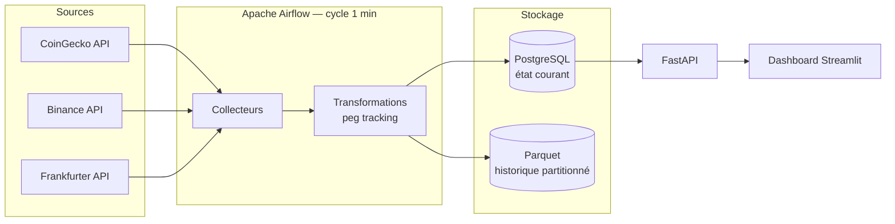

# 🌍 Crypto Market Pipeline — MVP Sénégal/UEMOA

Pipeline de données quasi temps réel pour 12 crypto-actifs, avec une
dimension analytique centrée sur le contexte financier de l'UEMOA :
affichage en FCFA, suivi du peg des stablecoins dans la durée, et
comparaison de la volatilité crypto à la stabilité du franc CFA.

Ce projet n'est pas un énième dashboard crypto — c'est une chaîne de
données complète : ingestion multi-source, orchestration, stockage
transactionnel + analytique, API, et restitution BI, entièrement
reproductible en local via Docker Compose.

## Sommaire

- [Architecture](#architecture)
- [Stack technique](#stack-technique)
- [Démarrage rapide](#démarrage-rapide)
- [Utilisation](#utilisation)
- [Modèle de données](#modèle-de-données)
- [Tests](#tests)
- [Limites et précautions](#limites-et-précautions)
- [Évolutions possibles](#évolutions-possibles)

## Architecture



Chaque collecteur valide ses données (champs obligatoires, plausibilité,
fraîcheur) et retente automatiquement en cas d'erreur temporaire
(backoff exponentiel) avant d'écrire en base — voir
[Limites et précautions](#limites-et-précautions) pour le détail des
garanties et de leurs limites.

## Stack technique

| Domaine | Technologie |
|---|---|
| Langage | Python 3.11 |
| Orchestration | Apache Airflow 3 (CeleryExecutor) |
| Stockage transactionnel | PostgreSQL 16 |
| Stockage analytique | Parquet partitionné (pyarrow) |
| API | FastAPI |
| Dashboard | Streamlit + Plotly |
| Tests | pytest |
| Conteneurisation | Docker / Docker Compose |

## Démarrage rapide

Prérequis : Docker Desktop, Python 3.11+, Git.

```bash
git clone <url-du-repo>
cd crypto-data-pipeline

# Configuration
cp .env.example .env
# Éditer .env : ajouter une clé CoinGecko Demo (gratuite sur
# https://www.coingecko.com/en/api/pricing) et un mot de passe PostgreSQL

python3.11 -m venv venv
source venv/bin/activate
pip install -r requirements.txt

# Lancer toute la stack
docker compose build
docker compose up airflow-init
docker compose up -d

# Activer le DAG (en pause par défaut au premier démarrage)
docker exec -it $(docker ps -qf "name=airflow-scheduler") \
  airflow dags unpause crypto_market_pipeline
```

## Utilisation

| Interface | URL | Identifiants |
|---|---|---|
| Dashboard | http://localhost:8501 | — |
| API (docs interactives) | http://localhost:8000/docs | — |
| Airflow | http://localhost:8080 | airflow / airflow |

Le dashboard comprend 6 vues : Vue générale, Crypto Explorer,
Comparaison, Stablecoins, Contexte FCFA/UEMOA, et Qualité Pipeline.

## Modèle de données

Table principale `crypto_market_snapshot` (un enregistrement par actif,
par source, par cycle de collecte) : prix USD/FCFA, volume, market cap,
variation 24h, source. Table `stablecoin_peg_history` : écart de peg
historisé pour USDT/USDC/DAI, avec flag d'alerte au-delà de 0,5 %. Table
`fx_rate_history` : historique du taux USD/EUR/XOF, nécessaire pour
comparer objectivement la volatilité crypto à la stabilité du FCFA.
Schéma complet : [`sql/schema.sql`](sql/schema.sql).

## Tests

```bash
pytest -m "not integration" -v   # tests unitaires, sans Docker
pytest -v                        # suite complète, Docker requis
```

Détail dans [`docs/TEST_REPORT.md`](docs/TEST_REPORT.md).

## Limites et précautions

- Les données de marché externes peuvent être incomplètes, retardées ou
  temporairement indisponibles — le pipeline continue de fonctionner en
  cas d'échec partiel d'une source.
- Une fréquence de collecte à la minute ne constitue pas un flux
  tick-by-tick — d'où l'appellation *quasi temps réel*.
- La conversion FCFA repose sur le taux USD/EUR de la BCE (Frankfurter)
  combiné à la parité fixe EUR/XOF (655,957) — pas un flux USD/XOF direct.
- Ce projet est un exercice technique et pédagogique : il ne constitue
  ni un conseil en investissement, ni une interprétation juridique du
  cadre réglementaire de l'UEMOA. Le contexte réglementaire affiché dans
  le dashboard est une photographie datée, à vérifier périodiquement.
- Ce produit utilise l'API CoinGecko sans en être endossé ni certifié
  officiellement par CoinGecko.

## Évolutions possibles

Extension à 50+ actifs, flux quasi temps réel via WebSocket, Kafka pour
une architecture streaming, Spark pour de gros volumes historiques,
alertes temps réel, interrogation en langage naturel des données via LLM.
Voir le document de cadrage complet du projet pour le détail.

---

Projet réalisé à des fins de portfolio Data Engineering, avec un accent
volontaire sur la reproductibilité (Docker), la fiabilité (retries,
validation, idempotence, tests) et la contextualisation régionale.
